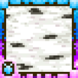

# Replete

Minecraft resource pack that focuses on accuracy in designs and attention to detail.  
Included in the [Venture](https://github.com/steves-underwater-paradise/venture) modpack.

## Compatibility

- Connected textures ([OptiFine format](https://optifine.readthedocs.io/ctm.html)): Some textures
  - [Continuity](https://modrinth.com/mod/continuity)
  - [OptiFine](https://optifine.net)
  - See also [OptiFine Alternatives](https://optifine.alternatives.lambdaurora.dev)
- [Particle Rain](https://modrinth.com/mod/particle-rain): Some textures (30% complete)
- [Big Globe](https://modrinth.com/mod/big-globe): Some textures (1% complete)
- [Regions Unexplored](https://modrinth.com/mod/regions-unexplored): Some textures (1% complete)
- [Twigs](https://modrinth.com/mod/twigs): Some textures (1% complete)
- [Universal Ores](https://modrinth.com/mod/universal_ores): Some textures (1% complete)

## Incompatibilities

[Create an issue](https://github.com/steves-underwater-paradise/replete/issues/new) on the issue tracker if you've found a mod that doesn't have resource pack textures/models!

## Download

See the version info in the filename for the supported Minecraft versions.  
Client-side.

## Contributing

If you've encountered a problem or you want to suggest
features, [create an issue](https://github.com/steves-underwater-paradise/replete/issues/new) on the issue tracker.

### Development

- `git clone https://github.com/steves-underwater-paradise/replete.git`
- `cd replete`

## License

This project is licensed under CC-BY-SA-4.0,
see [LICENSE](https://github.com/steves-underwater-paradise/replete/blob/1.20-1.20.1/LICENSE).
